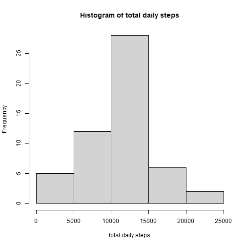
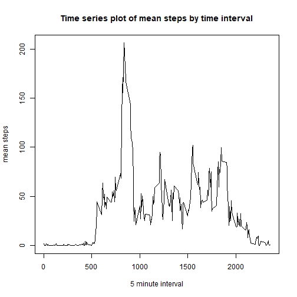
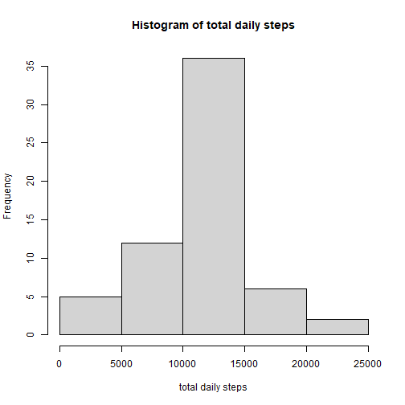
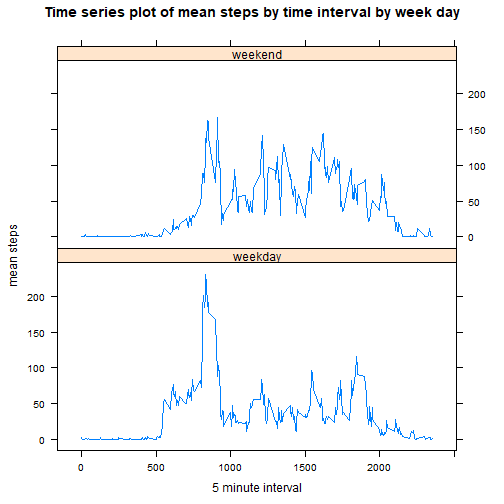

Activity Monitoring - Programming assignment 1 for Reproducible Research Course on Coursera

=========================


## Projec description
It is now possible to collect a large amount of data about personal movement using activity monitoring devices such as a Fitbit, Nike Fuelband, or Jawbone Up. These type of devices are part of the “quantified self” movement – a group of enthusiasts who take measurements about themselves regularly to improve their health, to find patterns in their behavior, or because they are tech geeks. But these data remain under-utilized both because the raw data are hard to obtain and there is a lack of statistical methods and software for processing and interpreting the data.

This assignment makes use of data from a personal activity monitoring device. This device collects data at 5 minute intervals through out the day. The data consists of two months of data from an anonymous individual collected during the months of October and November, 2012 and include the number of steps taken in 5 minute intervals each day.

## Loading and preprocessing the data
In this section I load the activity data from the provided zip file. The file is in a .csv format. Dates are converted to the date class

```r
# load data from zip file
activityData <- read.csv(unz("activity.zip", "activity.csv"), header = TRUE, sep = ",") 
activityData <- as.data.frame(activityData)

# convert dates
activityData$date <- as.Date(activityData$date, "%Y-%m-%d")
```

## What is mean total number of steps taken per day?
In this section I create a new dataframe which contains total steps per day. I present the histogram of the total number of steps taken per day. I also present the mean and the median of the total number of steps taken per day.

```r
# sum by date
activityDays <- unique(activityData$date)
activityDailysums <- tapply(activityData$steps, activityData$date, FUN=sum)

# create total steps per day dataframe
activityDaily <- data.frame(activityDays, activityDailysums)
names(activityDaily) <- c("day","total_steps")

# histogram of the total number of steps taken each day
hist(activityDaily$total_steps, xlab="total daily steps", main = "Histogram of total daily steps")
```



```r
# mean of the total number of steps taken per day
meanSumDay <- mean(activityDaily$total_steps, na.rm=TRUE)
print(meanSumDay)
```

```
## [1] 10766.19
```

```r
# median of the total number of steps taken per day
medianSumDay <- median(activityDaily$total_steps, na.rm=TRUE)
print(medianSumDay)
```

```
## [1] 10765
```

## What is the average daily activity pattern?
In this section I create a new dataframe which contains the mean number of steps per time interval during the day. I present a time series plot. I also present the 5-minute interval in which the maximum number of steps is taken, on average.

```r
# average by 5 minute interval
activityIntervals <- unique(activityData$interval)
activityIntervalMeans <- tapply(activityData$steps, activityData$interval, FUN=mean, na.rm=TRUE)

# create total steps per day dataframe
activityPattern <- data.frame(activityIntervals, activityIntervalMeans)
names(activityPattern) <- c("interval","mean_steps")

# time series plot
plot(activityPattern$interval, activityPattern$mean_steps,  type="l",xlab="5 minute interval", ylab="mean steps", main = "Time series plot of mean steps by time interval")
```



```r
# Which 5-minute interval, on average across all the days in the dataset, contains the maximum number of steps?
activityPattern$interval[which.max(activityPattern$mean_steps)]
```

```
## [1] 835
```

## Imputing missing values
Note that there are a number of days/intervals where there are missing values (coded as NA).
The presence of missing days may introduce bias into some calculations or summaries of the data.
In this section data is imputed. Missing step values are replaced with the mean value for the 5-minute interval. I present a new histogram of the total number of steps taken per day. I also present the mean and the median of the total number of steps taken per day. Finally, I compare the results to those of section 2.

```r
# Calculate and report the total number of missing values in the dataset
sum(is.na(activityData$steps))
```

```
## [1] 2304
```

```r
# Create a new dataset that is equal to the original dataset but with the missing data filled in with time interval mean.
library(dplyr)
activityDataImput  <- activityData %>% group_by(interval) %>% 
    mutate(steps = ifelse(is.na(steps),mean(steps, na.rm=TRUE), steps))

# sum by date
activityDailysumsImput <- tapply(activityDataImput$steps, activityDataImput$date, FUN=sum)

# create total steps per day dataframe
activityDailyImput <- data.frame(activityDays, activityDailysumsImput)
names(activityDailyImput) <- c("day","total_steps")

# Make a histogram of the total number of steps taken each day and Calculate and report the mean and median total number of steps taken per day. 
hist(activityDailyImput$total_steps, xlab="total daily steps", main = "Histogram of total daily steps")
```



```r
# mean of the total number of steps taken per day Imput
meanSumDayImput <- mean(activityDailyImput$total_steps, na.rm=TRUE)
print(meanSumDayImput)
```

```
## [1] 10766.19
```

```r
# median of the total number of steps taken per day Imput
medianSumDayImput <- median(activityDailyImput$total_steps, na.rm=TRUE)
print(medianSumDayImput)
```

```
## [1] 10766.19
```

```r
# Do these values differ from the estimates from the first part of the assignment?
meanSumDayImput == meanSumDay
```

```
## [1] TRUE
```

```r
medianSumDayImput == medianSumDay
```

```
## [1] FALSE
```

```r
# What is the impact of imputing missing data on the estimates of the total daily number of steps?
stringMeanChange <- ifelse(meanSumDayImput == meanSumDay, "not", "")
stringMedianChange <- ifelse(medianSumDayImput == medianSumDay, "not", "")

print(paste("Mean has", stringMeanChange, "changed", sep = " "))
```

```
## [1] "Mean has not changed"
```

```r
print(paste("Meadian has", stringMedianChange, "changed", sep = " "))
```

```
## [1] "Meadian has  changed"
```


## Are there differences in activity patterns between weekdays and weekends?
In this section I add the information of weekday/weekend to the data. I create a new dataframe which contains the mean number of steps per time interval during the day, with a factor level of "weekday" or "weekend". I present two time series plots.

```r
#Create a new factor variable in the dataset with two levels – “weekday” and “weekend” indicating whether a given date is a weekday or weekend day.
activityDataImput$weekend <- 
    factor(weekdays(activityDataImput$date), 
            levels=c("Monday","Tuesday", "Wednesday", "Thursday", "Friday", "Saturday", "Sunday"),
           labels=c("weekday","weekday","weekday","weekday","weekday","weekend","weekend"))
           
# average by 5 minute interval
activityIntervalImputMeans <- tapply(activityDataImput$steps,list(activityDataImput$interval,activityDataImput$weekend), FUN=mean, na.rm=TRUE)

# create total steps per day dataframe
activityPatternImput <- 
    data.frame(c(activityIntervals,activityIntervals), 
               c(activityIntervalImputMeans[,1],activityIntervalImputMeans[,2]),
               c(rep("weekday",length(activityIntervals)), rep("weekend",length(activityIntervals))))

names(activityPatternImput) <- c("interval","mean_steps", "weekend")
activityPatternImput$weekend <- factor(activityPatternImput$weekend)

# time series plot for weekdays and weekend separately
library(lattice)
xyplot(mean_steps ~ interval | weekend,
       data = activityPatternImput, type="l", layout= c(1,2), xlab="5 minute interval", ylab="mean steps", main = "Time series plot of mean steps by time interval by week day")
```


